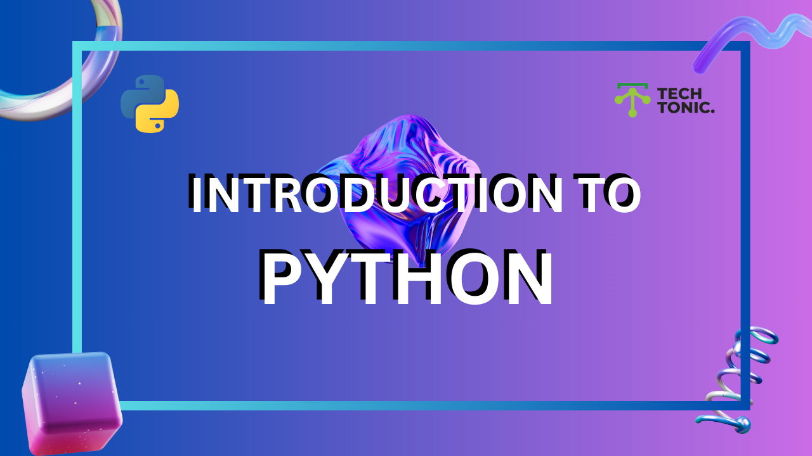

---

# **Abstraction in Python**


## **What is Abstraction?**

Abstraction is a way to hide the implementation details of a system and show only the essential features to the user. It focuses on **what an object can do** rather than **how it does it**.  

In Python, abstraction is implemented using **abstract classes** and **abstract methods**.

---

### **Why Use Abstraction?**
1. **Simplifies Complexity**: Users only see what’s necessary.  
2. **Increases Flexibility**: The implementation can be changed without affecting the user.  
3. **Promotes Reusability**: Common functionality is defined in a base class for reuse.  
4. **Ensures Consistency**: All derived classes follow the same structure.

---

## **How to Implement Abstraction in Python?**

Abstraction in Python is achieved using the `ABC` module (short for *Abstract Base Classes*).

### **Steps to Implement Abstraction**

1. Import the `ABC` module.  
2. Create a class that inherits from `ABC`.  
3. Use the `@abstractmethod` decorator to declare abstract methods.

---

### **Example: Abstraction in a Student Management System**

Let’s create a simple example of abstraction to demonstrate a **Student Management System**.

#### **Step 1: Create an Abstract Base Class**

We create an abstract class `Student` to define the basic structure of a student. This includes methods like `enroll()` and `get_grade()` but without their implementation.

```python
from abc import ABC, abstractmethod

class Student(ABC):
    def __init__(self, name, age):
        self.name = name
        self.age = age

    @abstractmethod
    def enroll(self):
        pass

    @abstractmethod
    def get_grade(self):
        pass
```

- **Abstract Class (`Student`)**: Cannot be instantiated directly.
- **Abstract Methods (`enroll`, `get_grade`)**: Must be implemented by subclasses.

---

#### **Step 2: Create Subclasses**

We now create specific types of students, each providing its own implementation of the abstract methods.

```python
class Undergraduate(Student):
    def enroll(self):
        return f"{self.name} has enrolled in an undergraduate course."

    def get_grade(self):
        return f"{self.name}'s grade: A"

class Graduate(Student):
    def enroll(self):
        return f"{self.name} is working on a research topic."

    def get_grade(self):
        return f"{self.name}'s grade: A+"
```

- **Undergraduate**: Enrolls in courses and gets grades.  
- **Graduate**: Focuses on research and gets grades.

---

#### **Step 3: Use the Subclasses**

Now we create objects of the `Undergraduate` and `Graduate` classes and call their methods.

```python
ug_student = Undergraduate("Alice", 20)
grad_student = Graduate("Bob", 25)

print(ug_student.enroll())  # Alice has enrolled in an undergraduate course.
print(ug_student.get_grade())  # Alice's grade: A

print(grad_student.enroll())  # Bob is working on a research topic.
print(grad_student.get_grade())  # Bob's grade: A+
```

---

## **Key Points to Remember**
1. An abstract class cannot be instantiated directly.
2. Abstract methods in the base class must be implemented in the derived class.
3. Abstraction focuses on what an object does, not how it does it.
4. Use the `ABC` module to define abstract classes in Python.

---

## **5 Practice Questions**

1. **Question 1**:  
   Create an abstract class `Vehicle` with methods `start_engine()` and `stop_engine()`. Then create a `Car` class that implements these methods.

2. **Question 2**:  
   Write a program to create an abstract class `Animal` with methods `make_sound()` and `move()`. Implement these in a `Dog` class.

3. **Question 3**:  
   Define an abstract class `Shape` with a method `area()`. Implement this method in `Circle` and `Square` classes.

4. **Question 4**:  
   Create an abstract class `BankAccount` with methods `deposit()` and `withdraw()`. Implement these in a `SavingsAccount` class.

5. **Question 5**:  
   Explain the difference between an abstract method and a regular method. Give an example to demonstrate.

---
---

### **Encapsulation in Python**


#### **What is Encapsulation?**

Encapsulation is a fundamental concept in Object-Oriented Programming (OOP). In simple terms, **encapsulation** means **bundling** the data (variables) and the methods (functions) that operate on the data into a single unit, known as a **class**. 

It also involves **restricting access** to certain details of an object to prevent accidental modification and enforcing controlled access.

---

#### **Why is Encapsulation Important?**

1. **Data Protection**: It allows you to hide sensitive information and provide controlled access to it.
2. **Maintainability**: Changes to an object's internal data can be made without affecting other parts of the program.
3. **Modularity**: Classes become self-contained, making the program easier to understand and manage.

---

#### **How to Achieve Encapsulation in Python?**

In Python, encapsulation is done by using **attributes** and **methods** with **access modifiers**:

- **Public**: The attribute or method is accessible from outside the class.
- **Private**: The attribute or method is not accessible from outside the class.

By convention:
- **Public attributes**: No underscores (`name`, `age`)
- **Private attributes**: One underscore (`_name`) – used to suggest that they are intended to be private.
- **Strongly private attributes**: Two underscores (`__name`) – Python mangles the name to make it harder to access directly.

-----------

#### **Basic Example of Encapsulation**

Here is a simple example to demonstrate encapsulation:

```python
class Student:
    def __init__(self, name, age):
        self.name = name         # Public attribute
        self._age = age          # Private attribute (by convention)
    
    def get_age(self):           # Public method to access private data
        return self._age
    
    def set_age(self, age):      # Public method to modify private data
        if age > 0:
            self._age = age
        else:
            print("Age must be positive!")

# Create an object of the Student class
student = Student("Alice", 20)

# Access public attribute
print(student.name)  # Output: Alice

# Access private attribute (not recommended directly)
# print(student._age)  # This will work but is not a good practice

# Use public method to access and modify private data
print(student.get_age())  # Output: 20
student.set_age(25)
print(student.get_age())  # Output: 25
```

### **Explanation:**

- `self.name`: This is a **public attribute**, meaning it can be accessed and modified directly from outside the class.
- `self._age`: This is a **private attribute** (by convention), meaning it should not be accessed directly from outside the class.
- `get_age()` and `set_age()`: These are **public methods** that control access to the private attribute `_age`.

---

#### **Access Modifiers in Python**

1. **Public Attributes/Methods**:  
   - These are accessible from anywhere in the program.
   - Example: `self.name`

2. **Private Attributes/Methods**:  
   - These are intended to be hidden from outside access. While Python does not enforce strict privacy, it uses a convention:
     - One underscore (`_name`) indicates that an attribute or method is "protected" (meant for internal use).
     - Two underscores (`__name`) triggers **name mangling**, making it harder to access the attribute directly, but it’s still not entirely private.

   Example:
   ```python
   class MyClass:
       def __init__(self):
           self.__private_variable = 10  # Private attribute
   
   obj = MyClass()
   # print(obj.__private_variable)  # This will raise an AttributeError
   
   # Accessing via name mangling (not recommended)
   print(obj._MyClass__private_variable)  # Output: 10
   ```

---

#### **Key Concepts Recap**

- **Encapsulation** is about protecting the data and restricting access to it.
- Use **private** attributes to prevent direct access to the internal details.
- Provide **public methods** (getters and setters) to control how private data is accessed or modified.

---

### **Best 5 Questions for Practice**

Here are five simple questions to help you practice encapsulation:

1. **Create a `Car` class with `make` and `model` attributes. Make the `make` attribute public and the `model` attribute private. Implement a method to get the `model` and set a new one.**
   
2. **Create a `BankAccount` class with a private attribute `balance`. Implement methods to deposit money, withdraw money, and check the balance. Make sure the balance cannot be accessed directly from outside the class.**

3. **In the `Student` class from the example, add a method to print the full name (`first name + last name`). Make the `first_name` and `last_name` attributes private.**

4. **Create a `Person` class with public attributes for `name` and `age`. Then create a `Teacher` class that inherits from `Person`, but make the `salary` attribute private and provide a method to get and set the salary.**

5. **Create a `Book` class with public attributes for `title` and `author`. Make the `price` attribute private and implement a method that sets a valid price (positive number) and gets the price.**

---

### **Conclusion**

- **Encapsulation** is one of the key principles of OOP and helps in protecting the data and ensuring that the internal state of an object can only be modified through well-defined methods.
- It allows us to control access to object properties and maintain the integrity of the data.
- By using private and public attributes/methods, we can hide sensitive details and provide a cleaner, more controlled interface for interacting with objects.

---
