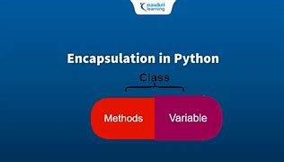

### **Encapsulation in Python: A Beginner's Guide**

#### **What is Encapsulation?**

Encapsulation is a fundamental concept in Object-Oriented Programming (OOP). In simple terms, **encapsulation** means **bundling** the data (variables) and the methods (functions) that operate on the data into a single unit, known as a **class**. 

It also involves **restricting access** to certain details of an object to prevent accidental modification and enforcing controlled access.

---

#### **Why is Encapsulation Important?**

1. **Data Protection**: It allows you to hide sensitive information and provide controlled access to it.
2. **Maintainability**: Changes to an object's internal data can be made without affecting other parts of the program.
3. **Modularity**: Classes become self-contained, making the program easier to understand and manage.

---

#### **How to Achieve Encapsulation in Python?**

In Python, encapsulation is done by using **attributes** and **methods** with **access modifiers**:

- **Public**: The attribute or method is accessible from outside the class.
- **Private**: The attribute or method is not accessible from outside the class.

By convention:
- **Public attributes**: No underscores (`name`, `age`)
- **Private attributes**: One underscore (`_name`) – used to suggest that they are intended to be private.
- **Strongly private attributes**: Two underscores (`__name`) – Python mangles the name to make it harder to access directly.

-----------

#### **Basic Example of Encapsulation**

Here is a simple example to demonstrate encapsulation:

```python
class Student:
    def __init__(self, name, age):
        self.name = name         # Public attribute
        self._age = age          # Private attribute (by convention)
    
    def get_age(self):           # Public method to access private data
        return self._age
    
    def set_age(self, age):      # Public method to modify private data
        if age > 0:
            self._age = age
        else:
            print("Age must be positive!")

# Create an object of the Student class
student = Student("Alice", 20)

# Access public attribute
print(student.name)  # Output: Alice

# Access private attribute (not recommended directly)
# print(student._age)  # This will work but is not a good practice

# Use public method to access and modify private data
print(student.get_age())  # Output: 20
student.set_age(25)
print(student.get_age())  # Output: 25
```

### **Explanation:**

- `self.name`: This is a **public attribute**, meaning it can be accessed and modified directly from outside the class.
- `self._age`: This is a **private attribute** (by convention), meaning it should not be accessed directly from outside the class.
- `get_age()` and `set_age()`: These are **public methods** that control access to the private attribute `_age`.

---

#### **Access Modifiers in Python**

1. **Public Attributes/Methods**:  
   - These are accessible from anywhere in the program.
   - Example: `self.name`

2. **Private Attributes/Methods**:  
   - These are intended to be hidden from outside access. While Python does not enforce strict privacy, it uses a convention:
     - One underscore (`_name`) indicates that an attribute or method is "protected" (meant for internal use).
     - Two underscores (`__name`) triggers **name mangling**, making it harder to access the attribute directly, but it’s still not entirely private.

   Example:
   ```python
   class MyClass:
       def __init__(self):
           self.__private_variable = 10  # Private attribute
   
   obj = MyClass()
   # print(obj.__private_variable)  # This will raise an AttributeError
   
   # Accessing via name mangling (not recommended)
   print(obj._MyClass__private_variable)  # Output: 10
   ```

---

#### **Key Concepts Recap**

- **Encapsulation** is about protecting the data and restricting access to it.
- Use **private** attributes to prevent direct access to the internal details.
- Provide **public methods** (getters and setters) to control how private data is accessed or modified.

---

### **Best 5 Questions for Practice**

Here are five simple questions to help you practice encapsulation:

1. **Create a `Car` class with `make` and `model` attributes. Make the `make` attribute public and the `model` attribute private. Implement a method to get the `model` and set a new one.**
   
2. **Create a `BankAccount` class with a private attribute `balance`. Implement methods to deposit money, withdraw money, and check the balance. Make sure the balance cannot be accessed directly from outside the class.**

3. **In the `Student` class from the example, add a method to print the full name (`first name + last name`). Make the `first_name` and `last_name` attributes private.**

4. **Create a `Person` class with public attributes for `name` and `age`. Then create a `Teacher` class that inherits from `Person`, but make the `salary` attribute private and provide a method to get and set the salary.**

5. **Create a `Book` class with public attributes for `title` and `author`. Make the `price` attribute private and implement a method that sets a valid price (positive number) and gets the price.**

---

### **Conclusion**

- **Encapsulation** is one of the key principles of OOP and helps in protecting the data and ensuring that the internal state of an object can only be modified through well-defined methods.
- It allows us to control access to object properties and maintain the integrity of the data.
- By using private and public attributes/methods, we can hide sensitive details and provide a cleaner, more controlled interface for interacting with objects.

---
